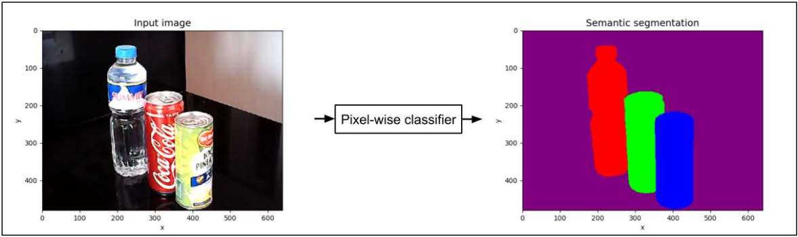
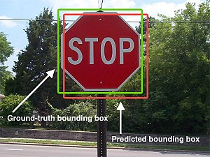
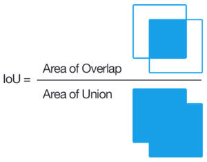
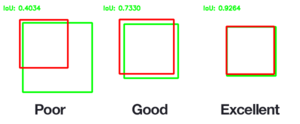

# [Dstl Satellite Imagery Feature Detection](https://www.kaggle.com/c/dstl-satellite-imagery-feature-detection/overview)

## Semantic segmentation


## [Jaccard index](https://en.wikipedia.org/wiki/Jaccard_index)
The Jaccard coefficient measures similarity between finite sample sets, and is defined as the size of the intersection divided by the size of the union of the sample sets.
  
  
  

## Getting started

### Creating a virtual environment
``` bash
# Create
python3 -m venv .satenv

# Source
source .satenv/bin/activate

# Install requirements
pip install -r requirements
```